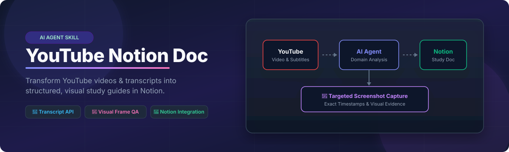

<p align="center">
  
</p>

<p align="center">
  <a href="https://github.com/nyalakondasheshankadesai-jpg/youtube-notion-doc"></a>
  <a href="https://www.notion.so"></a>
  <a href="https://youtube.com"></a>
  <a href="LICENSE"></a>
</p>

---

## 💡 Overview

**YouTube Notion Doc** is an AI Agent Skill designed to transform YouTube videos and transcripts into comprehensive, domain-aware study documentation in **Notion**. 

Instead of generating generic summary paragraphs, it combines **transcript breakdown**, **targeted timestamp analysis**, and **high-resolution screenshot extraction** to produce structured Notion pages complete with visual evidence, interactive glossaries, action items, and revision questions.

---

## ✨ Key Features

- 🧠 **Domain-Aware Key Moment Identification**: Detects pivotal strategic moves (Chess), structural code shifts (Programming), formula derivations (Mathematics), or slide transitions (Lectures).
- 📸 **Automated High-Res Screenshot Capture**: Extracts exact visual frames at key timestamps using `ffmpeg` & `yt-dlp`.
- 📝 **Rich Notion Page Generation**: Constructs formatted Notion blocks including Callout headers, Image blocks, Checklists, Glossaries, and Quiz questions.
- ⚡ **Seamless Agent Workflow**: Designed for pair-programming agents and automated scripts with minimal setup.

---

## 🛠️ Pipeline Architecture

```text
┌─────────────────┐      ┌─────────────────────────┐      ┌─────────────────────────┐
│  YouTube Video  │ ───► │  Metadata & Subtitles   │ ───► │  Key Moment Selection   │
└─────────────────┘      └─────────────────────────┘      └─────────────────────────┘
                                                                       │
┌─────────────────┐      ┌─────────────────────────┐                   ▼
│   Notion Page   │ ◄─── │  Notion API / MCP Sync │ ◄─── │  Targeted Screenshots   │
└─────────────────┘      └─────────────────────────┘      └─────────────────────────┘
```

---

## 📂 Repository Structure

```text
youtube-notion-doc/
│
├── 📄 SKILL.md                 # System prompt instructions & domain analysis rules for AI agents
├── 📄 README.md                # Project documentation & setup instructions
│
├── 📁 assets/                  # Project media & visual branding
│   └── 📁 readme/
│       └── 🎨 hero.svg         # SVG hero banner and component architecture diagram
│
├── 📁 scripts/                 # Core deterministic python tools
│   └── 🐍 get_youtube_data.py  # Retrieves YouTube video metadata & subtitles via YouTube API
│
└── 📁 evals/                   # Quality assurance & evaluation benchmarks
    └── 📋 evals.json           # Test cases & expected output schemas for validation
```

### Component Details

| File / Folder | Type | Purpose & Description |
| :--- | :--- | :--- |
| **`SKILL.md`** | AI Prompt SOP | The core skill instruction file guiding AI agents through transcript processing, timestamp detection, screenshot capture, and Notion block layout. |
| **`README.md`** | Documentation | The repository homepage containing feature summaries, setup commands, visual architecture diagrams, and usage examples. |
| **`assets/readme/hero.svg`** | SVG Asset | Scalable vector graphic used as the hero header banner for the repository. |
| **`scripts/get_youtube_data.py`** | Python Tool | Fetches metadata (title, duration, channel) and full timestamped transcript arrays from YouTube video URLs. |
| **`evals/evals.json`** | Benchmark | Contains test evaluation cases to verify skill execution consistency across video inputs. |

---

## 🚀 Quick Start

### 1. Prerequisites
Ensure Python 3.10+ and standard dependencies are installed:
```bash
pip install youtube-transcript-api requests yt-dlp
```

### 2. Extract Transcript & Metadata
Run the metadata extraction script with your YouTube URL:
```bash
python scripts/get_youtube_data.py "https://youtu.be/oIlD1REf6a8" --output-dir "./.tmp"
```
This generates `.tmp/video_info.json` containing structured transcript blocks and video metadata.

### 3. Generate Notion Documentation
Use your Notion Integration Key or Notion MCP server to publish the page:
```bash
python .tmp/upload_screenshots_and_update_notion.py
```

---

## 📄 License

Distributed under the MIT License. See `LICENSE` for more information.